# PSoC&trade; 4: MSCLP multi-phase mutual-capacitance touchpad

This code example demonstrates a CAPSENSE&trade; multi-phase CSX (MPTX) touchpad implemented on the [PSoC&trade; 4000T CAPSENSE&trade; Evaluation Kit](https://www.infineon.com/CY8CKIT-040T) (`CY8CKIT-040T`) and showcases the performance improvement over regular CSX. Here, CAPSENSE&trade; crosspoint (CSX) represents the mutual-capacitance sensing techniques.

In addition, this code example also explains how to use the CAPSENSE&trade; Tuner GUI, measurement of SNR, current consumption, and processing time.

> **Note:** This code example assumes you have a working understanding of the CAPSENSE&trade; CSX technique and its tuning. If you are new to CAPSENSE&trade; and CSX, see the [PSoC&trade; 4: MSCLP multitouch mutual-capacitance touchpad tuning](https://github.com/Infineon/mtb-example-psoc4-msclp-csx-touchpad) code example.

**MPTX:** Multi-phase TX is a technique used for mutual capacitance sensing where all the Tx electrodes are driven simultaneously with modulated patterns by the firmware and the result is then de-convoluted to detect touch positions. The advantage is higher SNR.


[View this README on GitHub.](https://github.com/Infineon/mtb-example-psoc4-msclp-mptx-touchpad)

[Provide feedback on this code example.](https://cypress.co1.qualtrics.com/jfe/form/SV_1NTns53sK2yiljn?Q_EED=eyJVbmlxdWUgRG9jIElkIjoiQ0UyMzkwMzciLCJTcGVjIE51bWJlciI6IjAwMi0zOTAzNyIsIkRvYyBUaXRsZSI6IlBTb0MmdHJhZGU7IDQ6IE1TQ0xQIG11bHRpLXBoYXNlIG11dHVhbC1jYXBhY2l0YW5jZSB0b3VjaHBhZCIsInJpZCI6Im1heXVyIGNoYW5kYWsiLCJEb2MgdmVyc2lvbiI6IjEuMC4wIiwiRG9jIExhbmd1YWdlIjoiRW5nbGlzaCIsIkRvYyBEaXZpc2lvbiI6Ik1DRCIsIkRvYyBCVSI6IklDVyIsIkRvYyBGYW1pbHkiOiJQU09DIn0=)


## Requirements


- [ModusToolbox&trade;](https://www.infineon.com/modustoolbox) v3.1 or later

   > **Note:** This code example requires ModusToolbox&trade; version 3.1 or later, and is not backward compatible with v3.0 or earlier versions.

- Board support package (BSP) minimum required version: 3.1.0
- Programming language: C
- Associated parts: [PSoC&trade; 4000T](https://www.infineon.com/cms/en/product/microcontroller/32-bit-psoc-arm-cortex-microcontroller/psoc-4-32-bit-arm-cortex-m0-mcu/psoc-4000/psoc-4000t/)


## Supported toolchains (make variable 'TOOLCHAIN')

- GNU Arm&reg; Embedded Compiler v11.3.1 (`GCC_ARM`) – Default value of `TOOLCHAIN`
- Arm&reg; Compiler v6.16 (`ARM`)
- IAR C/C++ Compiler v9.30.1 (`IAR`)


## Supported kits (make variable 'TARGET')

- [PSoC&trade; 4000T CAPSENSE&trade; Evaluation Kit](https://www.infineon.com/CY8CKIT-040T) (`CY8CKIT-040T`) – Default value of `TARGET`


## Hardware setup

This example uses the board's default configuration. See the [kit user guide](https://www.infineon.com/002-34870) to ensure that the board is configured correctly to use $V_{DDA}$ at 1.8 V.

## Software setup

See the [ModusToolbox&trade; tools package installation guide](https://www.infineon.com/ModusToolboxInstallguide) for information about installing and configuring the tools package.

This example requires no additional software or tools.


## Using the code example

### Create the project

The ModusToolbox&trade; tools package provides the Project Creator as both a GUI tool and a command line tool.

<details><summary><b>Use Project Creator GUI</b></summary>

1. Open the Project Creator GUI tool.

   There are several ways to do this, including launching it from the dashboard or from inside the Eclipse IDE. For more details, see the [Project Creator user guide](https://www.infineon.com/ModusToolboxProjectCreator) (locally available at *{ModusToolbox&trade; install directory}/tools_{version}/project-creator/docs/project-creator.pdf*).

2. On the **Choose Board Support Package (BSP)** page, select a kit supported by this code example. See [Supported kits](#supported-kits-make-variable-target).

   > **Note:** To use this code example for a kit not listed here, you may need to update the source files. If the kit does not have the required resources, the application may not work.

3. On the **Select Application** page:

   a. Select the **Applications(s) Root Path** and the **Target IDE**.

   > **Note:** Depending on how you open the Project Creator tool, these fields may be pre-selected for you.

   b.	Select this code example from the list by enabling its check box.

   > **Note:** You can narrow the list of displayed examples by typing in the filter box.

   c. (Optional) Change the suggested **New Application Name** and **New BSP Name**.

   d. Click **Create** to complete the application creation process.

</details>

<details><summary><b>Use Project Creator CLI</b></summary>

The 'project-creator-cli' tool can be used to create applications from a CLI terminal or from within batch files or shell scripts. This tool is available in the *{ModusToolbox&trade; install directory}/tools_{version}/project-creator/* directory.

Use a CLI terminal to invoke the 'project-creator-cli' tool. On Windows, use the command-line 'modus-shell' program provided in the ModusToolbox&trade; installation instead of a standard Windows command-line application. This shell provides access to all ModusToolbox&trade; tools. You can access it by typing "modus-shell" in the search box in the Windows menu. In Linux and macOS, you can use any terminal application.

The following example clones the "[mtb-example-psoc4-msclp-mptx-touchpad](https://github.com/Infineon/mtb-example-psoc4-msclp-mptx-touchpad)" application with the desired name "MsclpMptxTouchpad" configured for the *CY8CKIT-040T* BSP into the specified working directory, *C:/mtb_projects*:

   ```
   project-creator-cli --board-id CY8CKIT-040T --app-id mtb-example-psoc4-msclp-mptx-touchpad --user-app-name MsclpMptxTouchpad --target-dir "C:/mtb_projects"
   ```


The 'project-creator-cli' tool has the following arguments:

Argument | Description | Required/optional
---------|-------------|-----------
`--board-id` | Defined in the <id> field of the [BSP](https://github.com/Infineon?q=bsp-manifest&type=&language=&sort=) manifest | Required
`--app-id`   | Defined in the <id> field of the [CE](https://github.com/Infineon?q=ce-manifest&type=&language=&sort=) manifest | Required
`--target-dir`| Specify the directory in which the application is to be created if you prefer not to use the default current working directory | Optional
`--user-app-name`| Specify the name of the application if you prefer to have a name other than the example's default name | Optional

> **Note:** The project-creator-cli tool uses the `git clone` and `make getlibs` commands to fetch the repository and import the required libraries. For details, see the "Project creator tools" section of the [ModusToolbox&trade; tools package user guide](https://www.infineon.com/ModusToolboxUserGuide) (locally available at {ModusToolbox&trade; install directory}/docs_{version}/mtb_user_guide.pdf).

</details>


### Open the project

After the project has been created, you can open it in your preferred development environment.


<details><summary><b>Eclipse IDE</b></summary>

If you opened the Project Creator tool from the included Eclipse IDE, the project will open in Eclipse automatically.

For more details, see the [Eclipse IDE for ModusToolbox&trade; user guide](https://www.infineon.com/MTBEclipseIDEUserGuide) (locally available at *{ModusToolbox&trade; install directory}/docs_{version}/mt_ide_user_guide.pdf*).

</details>


<details><summary><b>Visual Studio (VS) Code</b></summary>

Launch VS Code manually, and then open the generated *{project-name}.code-workspace* file located in the project directory.

For more details, see the [Visual Studio Code for ModusToolbox&trade; user guide](https://www.infineon.com/MTBVSCodeUserGuide) (locally available at *{ModusToolbox&trade; install directory}/docs_{version}/mt_vscode_user_guide.pdf*).

</details>


<details><summary><b>Keil µVision</b></summary>

Double-click the generated *{project-name}.cprj* file to launch the Keil µVision IDE.

For more details, see the [Keil µVision for ModusToolbox&trade; user guide](https://www.infineon.com/MTBuVisionUserGuide) (locally available at *{ModusToolbox&trade; install directory}/docs_{version}/mt_uvision_user_guide.pdf*).

</details>


<details><summary><b>IAR Embedded Workbench</b></summary>

Open IAR Embedded Workbench manually, and create a new project. Then select the generated *{project-name}.ipcf* file located in the project directory.

For more details, see the [IAR Embedded Workbench for ModusToolbox&trade; user guide](https://www.infineon.com/MTBIARUserGuide) (locally available at *{ModusToolbox&trade; install directory}/docs_{version}/mt_iar_user_guide.pdf*).

</details>


<details><summary><b>Command line</b></summary>

If you prefer to use the CLI, open the appropriate terminal, and navigate to the project directory. On Windows, use the command-line 'modus-shell' program; on Linux and macOS, you can use any terminal application. From there, you can run various `make` commands.

For more details, see the [ModusToolbox&trade; tools package user guide](https://www.infineon.com/ModusToolboxUserGuide) (locally available at *{ModusToolbox&trade; install directory}/docs_{version}/mtb_user_guide.pdf*).

</details>

<br>

The project is configured with the necessary settings by default. Therefore, you can proceed to the [Operation](#operation) section to test the example. However, if you want to understand the tuning process and follow the stages for this kit, or apply it on your own board, see [Tuning procedure](#tuning-procedure-for-mptx-enabled-widgets) and then test it using the [Operation](#operation) section.

## Operation

1. Connect the board to your PC using the provided Micro-B USB cable through the KitProg3 USB connector.

   **Figure 1. Connecting the [CY8CKIT-040T](https://www.infineon.com/CY8CKIT-040T) kit with the PC**

   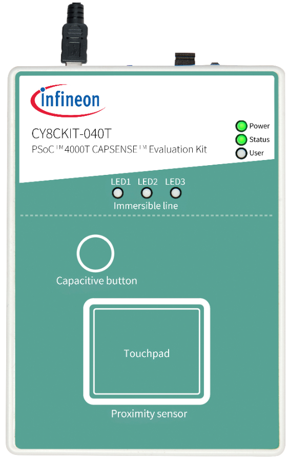

2. Program the board using one of the following:

   <details><summary><b>Using Eclipse IDE</b></summary>

      1. Select the application project in the Project Explorer.

      2. In the **Quick Panel**, scroll down, and click **\<Application Name> Program (KitProg3_MiniProg4)**.
   </details>


   <details><summary><b>In other IDEs</b></summary>

   Follow the instructions in your preferred IDE.
   </details>


   <details><summary><b>Using CLI</b></summary>

     From the terminal, execute the `make program` command to build and program the application using the default toolchain to the default target. The default toolchain is specified in the application's Makefile but you can override this value manually:
      ```
      make program TOOLCHAIN=<toolchain>
      ```

      Example:
      ```
      make program TOOLCHAIN=GCC_ARM
      ```
   </details>

3. After programming, the application starts automatically.

   > **Note:** After programming, you see the following error message if debug mode is disabled. This can be ignored or enabling debug solves this error.

   ```
   "Error: Error connecting Dp: Cannot read IDR"
   ```

4. To test the application, slide your finger over the CAPSENSE&trade; touchpad and observe that LED1 and LED3 turn ON with green color when touched and turn OFF when the finger is lifted.
   - LED1 brightness increases when the finger is moved from bottom-to-top, with bottom row having minimum and top row having maximum brightness.
   - LED3 brightness increases when the finger is moved from left-to-right, with left column having minimum and right column having maximum brightness.
   
5. You can also monitor the CAPSENSE&trade; data using the CAPSENSE&trade; Tuner application as follows:

   **Monitor data using CAPSENSE&trade; Tuner**

   1. Open CAPSENSE&trade; Tuner from the tools section in the IDE **Quick Panel**.

      You can also run the CAPSENSE&trade; Tuner application in standalone mode from *{ModusToolbox&trade; install directory}/ModusToolbox/tools_{version}/capsense-configurator/capsense-tuner*. In this case, after opening the application, select **File** > **Open** and open the *design.cycapsense* file of the respective application, which is located in the *{Application root directory}/bsps/TARGET_APP_\<BSP-NAME>/config/* folder.

      See the [ModusToolbox&trade; software user guide](https://www.infineon.com/ModusToolboxUserGuide) (locally available at *ModusToolbox&trade; install directory}/docs_{version}/mtb_user_guide.pdf*) for options to open the CAPSENSE&trade; Tuner application using the CLI.

   2. Ensure that the kit is in CMSIS-DAP bulk mode (KitProg3 status LED is ON and not blinking). See [Firmware-loader](https://github.com/Infineon/Firmware-loader) to learn how to update the firmware and switch modes in KitProg3.

   3. In the tuner application, click on the **Tuner Communication Setup** icon or select **Tools** > **Tuner Communication Setup**. In the window, select I2C under KitProg3 and configure as follows:

       - **I2C address:** 8
       - **Sub-address:** 2-Bytes
       - **Speed (kHz):** 400

        These are the same values set in the EZI2C resource.

        **Figure 2. Tuner communication setup parameters**

        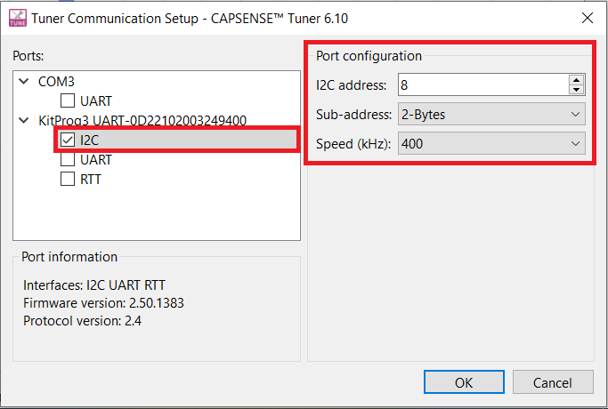

   4. Click **Connect** or select **Communication** > **Connect** to establish a connection.

        **Figure 3. Establish a connection**

        

   5. Click **Start** or select **Communication** > **Start** to start data streaming from the device.

         **Figure 4. Start tuner communication**

         

         The **Widget/Sensor parameters** tab gets updated with the parameters configured in the **CAPSENSE&trade; configurator** window. The tuner displays the data from the sensor in the **Widget View** and **Graph View** tabs.

6. Set the **Read Mode** to the **Synchronized** mode. Under the **Widget View** tab, you can see the touchpad widget sensors highlighted when you touch it.

      **Figure 5. Widget view of the CAPSENSE&trade; Tuner**

      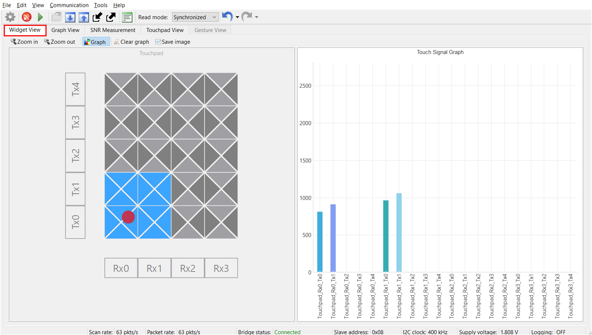

7. You can view the raw count, baseline, difference count for each sensor and also the touchpad position in the **Graph View** tab. For example, to view the sensor data for a single sensor in the touchpad, select **Touchpad_Rx0_Tx0** under **Touchpad**.
   
    
   **Figure 6. Graph view of the CAPSENSE&trade; Tuner**

   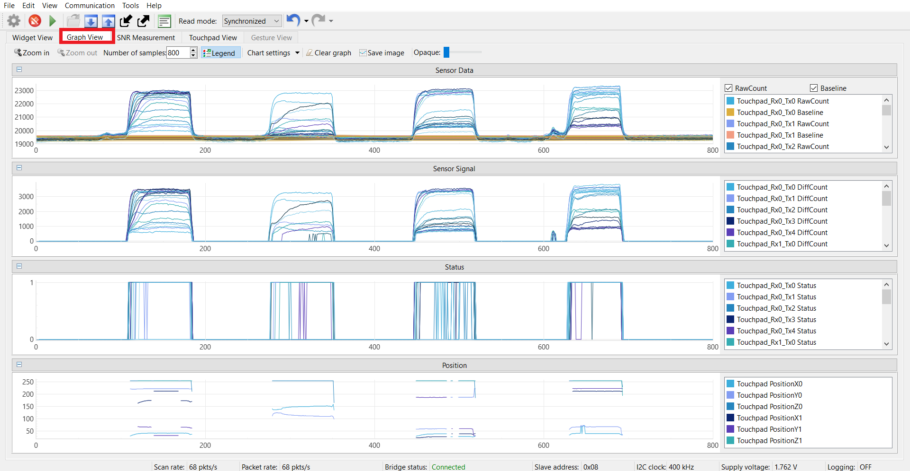

8. The **Touchpad View** tab shows the heat map view and the finger movement can be visualized on the same.

   **Figure 7. Touchpad view of the CAPSENSE&trade; Tuner**

   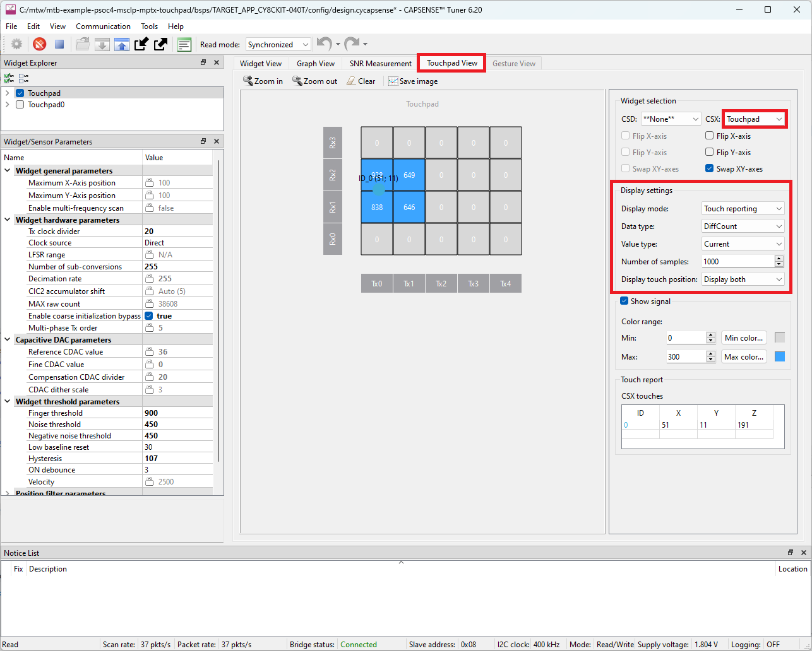

9. Observe the **Widget Parameters** section in the CAPSENSE&trade; Tuner window. The reference CDAC values for the widget is calculated by the CAPSENSE&trade; middleware and is displayed as shown in **Figure 7**. Compensation CDAC value for each sensor, which is also calculated by the CAPSENSE&trade; middleware, can be observed by selecting the sensor element in the **Widget Explorer** window.

### Operating at other voltages

[CY8CKIT-040T kit](https://www.infineon.com/CY8CKIT-040T) supports operating voltages of 1.8 V, 3.3 V, and 5 V. Use the voltage selection switch available on top of the kit to set the preferred operating voltage and see the [Set up the VDDA supply voltage in Device Configurator](#set-up-the-vdda-supply-voltage-in-device-configurator) section.

This application is optimally tuned for 1.8 V. However, you can observe the basic functionality working across other voltages. It is recommended to tune the application at the selected voltage for optimum performance.

### Tuning procedure for MPTX enabled widgets

Tuning procedure for MPTX enabled widgets is the same as that of regular CSX widgets. See the [PSoC&trade; 4: MSCLP multi-touch mutual-capacitance touchpad tuning](https://github.com/Infineon/mtb-example-psoc4-msclp-csx-touchpad) code example to know more about tuning CSX widgets.

### Measuring and comparing SNR of regular CSX vs MPTX widgets

There are 2 touchpad widgets configured in the design which use the same Tx and Rx electrodes, **"Touchpad"** widget configured with MPTX and **"Touchpad0"** widget configured without MPTX. These widgets are scanned sequentially one after other providing comparison of the performance.
1. Program the board if not already programmed.

2. Launch the CAPSENSE&trade; Tuner to monitor the CAPSENSE&trade; data and for CAPSENSE&trade; parameter tuning and SNR measurement.

   See the [ModusToolbox&trade; CAPSENSE&trade; Tuner guide](https://www.infineon.com/ModusToolboxCapSenseTuner) for step-by-step instructions on how to launch and configure the CAPSENSE&trade; Tuner in ModusToolbox&trade;.

3. Capture and note the peak-to-peak noise of each sensor element in the touchpad.

   1. From the **Widget Explorer** section, select the **Touchpad** widget (configured with MPTX enabled).

   2. Go to the **Touchpad View** tab and change the **Display settings** as follows:

      - **Display mode:** Touch reporting

      - **Data type:** RawCount

      - **Value type:** Max-Min

      - **Number of Samples:** 1000

      Wait for 5 seconds and then note the highest value on the heat map of the touchpad without placing a finger. This is the maximum peak-to-peak noise for 1000 samples.
      
      To refresh the values, click **Clear** in the tabs above the touchpad heat map as shown in **Figure 8**.

      > **Note:** In **Widget selection**, enable **Swap XY-axes** for proper visualization of finger movement on the touchpad.

      **Figure 8. Noise for Touchpad widget on the Touchpad View tab in the tuner window**

      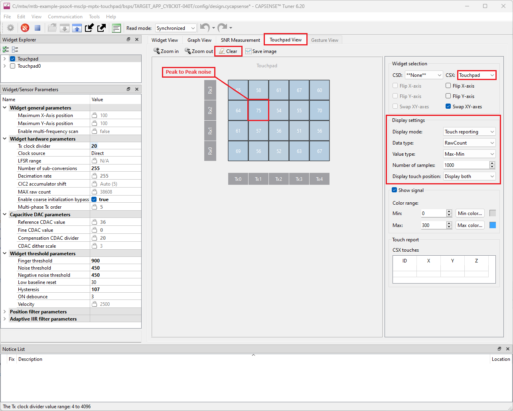

      <br>

       Here, the measured peak-to-peak noise is **75**.

4. Measure least touch intensity (LTI) signal.

   1. Place the finger such that an almost equal signal is obtained in all four intersecting nodes (see the heat map displayed in the **Touchpad View** tab as shown in the following figure). This position is called the least touch intensity (LTI) position (at the intersection of four nodes) as shown in the following figure.

      > **Note:** The LTI signal is measured at the farthest point of the touchpad from the sensor pin connection, where the sensors have the worst-case RC-time constant. Additionally, finger movement during the test can artificially increase the noise level.

   2. Go to the **Touchpad View** tab and change the **Display settings** as follows:

      - **Display mode:** Touch reporting

      - **Data type:** DiffCount

      - **Value type:** Current

      **Figure 9. LTI position in Touchpad View**

      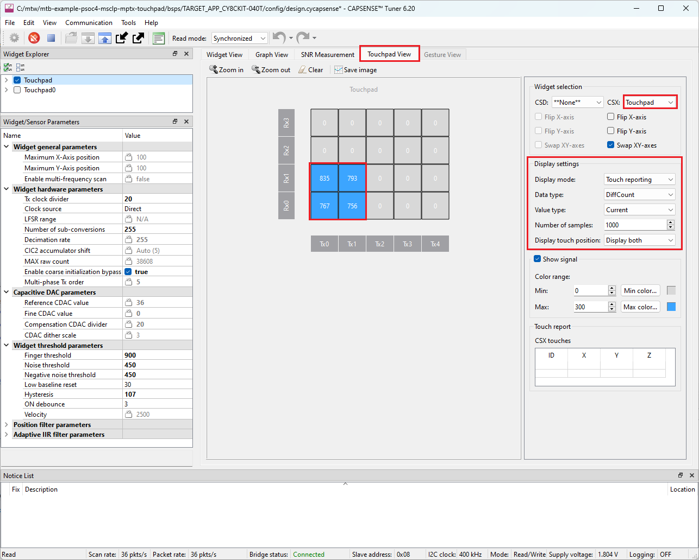

      <br>

      Here, the measured LTI signal is:

      **LTI Signal** = (835 + 793 + 767 + 756)/4 = 787

   <br>

5. Repeat the steps 3 and 4 for the **Touchpad0** widget (without MPTX), by selecting the **Touchpad0** widget from the **Widget Explorer** section.

   The measured maximum peak-to-peak noise is **131**.

      And the measured LTI signal is:

      **LTI Signal** = (734 + 770 + 721 + 792)/4 = 754

<br>

6. Calculating and comparing the SNR

   Calculate the SNR using **Equation 1** as follows:

      **Equation 1: Measuring the SNR**
      $$SNR = \frac{Signal_{LTI}}{Noise_{Pk}}$$

      Where,
      - $Signal_{LTI}$ = LTI signal according to Step 3

      - $Noise_{Pk}$ = Peak-to-peak noise according to Step 4
      
      <br>

   As measured earlier, the $Signal_{LTI}$ and $Noise_{Pk}$ for both of the widgets (with and without MPTX) as follows:

      **Table 1. SNR calculated for widget with and without MPTX**

      |Widget                    | LTI Signal                      | Noise  | SNR        |
      |:-------------------------|:--------------------------------|--------|------------|
      |"Touchpad" (with MPTX)    |(835 + 793 + 767 + 756)/4 = 787  | 75     | **10.49**   |
      |"Touchpad0" (without MPTX)|(734 + 770 + 721 + 792)/4 = 754  | 131    | **5.75**   |

<br>

   With the multi-phase MPTX technique enabled in the system, theoretical SNR improvement of $\sqrt{Tx_{Order}}$ can be obtained. As seen in this example, the SNR improvement is approximately **82%**. See [AN234185 – PSoC&trade; 4 CAPSENSE&trade; touchpad design guide](https://www.infineon.com/AN234185) for more details.

### Measuring and comparing processing time of regular CSX vs. MPTX widget scans

As MPTX employs convolution and de-convolution methods, one disadvantage of using the MPTX technique is the higher processing time for the scan raw data. To compare the processing time of the touchpad widgets, do the following:

1. Enable widget raw data process time measurement using the following macro in the *main.c* file:

      ```      
      #define ENABLE_WDGT_PROCESS_TIME_MEASUREMENT (1u)
      ```
2. Enable the debug mode.
   
   By default, the debug mode is disabled for this application to reduce power consumption. Enable the debug mode to enable the SWD pins as follows:

   **Figure 10. Enable debug mode in the System tab of Device Configurator**

   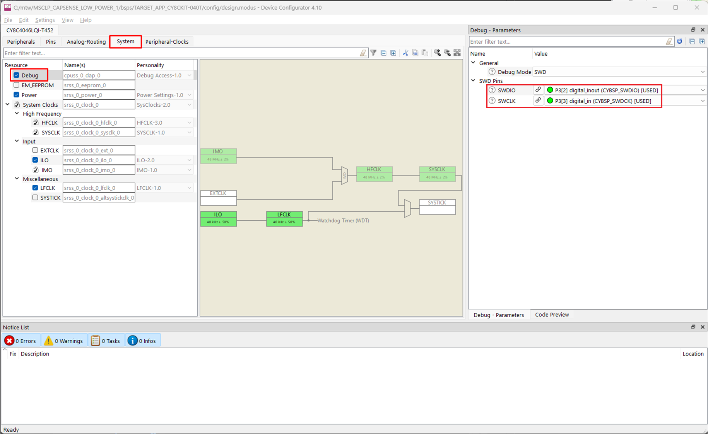

   <br>

3. Add the breakpoint in the *main.c* file as follows:

   ```
      #if ENABLE_WDGT_PROCESS_TIME_MEASUREMENT
         /* Clear SysTick Timer to start afresh measurement */
         Cy_SysTick_Clear();
         /* Process only MPTX enabled touchpad widget */
         Cy_CapSense_ProcessWidget(CY_CAPSENSE_TOUCHPAD_WDGT_ID,&cy_capsense_context);
         mptx_wgt_process_time = get_systick_time();

         /* Clear SysTick Timer to start afresh measurement */
         Cy_SysTick_Clear();
         /* Process only MPTX enabled touchpad widget */
         Cy_CapSense_ProcessWidget(CY_CAPSENSE_TOUCHPAD0_WDGT_ID,&cy_capsense_context);
         csx_wgt_process_time = get_systick_time();
   >     csx_wgt_process_time = 0;
      #else
   ```

4. Connect the kit to your PC, launch, and run the application in debug mode.

5. Read the variable `mptx_wgt_process_time` and `csx_wgt_process_time` by adding them to the **Expressions** view tab.

   The scan process time measured with and without MPTX as shown in the following table.

   **Table 2. Measured scan process time for widget with and without MPTX**

    Widget                    | Scan process time
    :-------------------------|:-------------------
    **Touchpad** (with MPTX)    |224 microseconds
    **Touchpad0** (without MPTX)|127 microseconds

### Measuring and comparing current consumption of regular CSX vs MPTX widgets

One of the disadvantages of using the MPTX technique is increased current consumption. The increase in current consumption is as follows:
- Tx current = Approximately $M*I_{Tx}$, ($M$ = number of Tx electrodes, $I_{Tx}$ = Tx current in regular CSX technique)
- Rx current >= $2*I_{Rx}$, ($I_{Rx}$ = Rx current in regular CSX technique)

To compare the current consumption because of the addition of the MPTX widget, do the following:

1. Disable the serial LED, tuner communication, and process time measurement using the following macros:

   ```      
   #define ENABLE_SPI_SERIAL_LED              (0u)
   ```

   ```
   #define ENABLE_TUNER                       (0u)
   ```

   ```
    #define ENABLE_PROCESS_TIME_MEASUREMENT   (0u)
   ```

2. Delete the **Touchpad0** widget from the configuration as shown in the following figure and save the configuration.

   **Figure 11. Delete the Touchpad0 widget**

   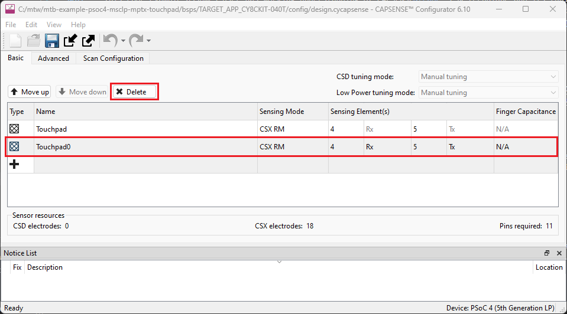

   <br>

3. Reprogram the kit.

4. Connect the kit to a power analyzer, such as KEYSIGHT - N6705C, using a current measure header as shown in the following figure:

   **Figure 12. Power analyzer connection**

   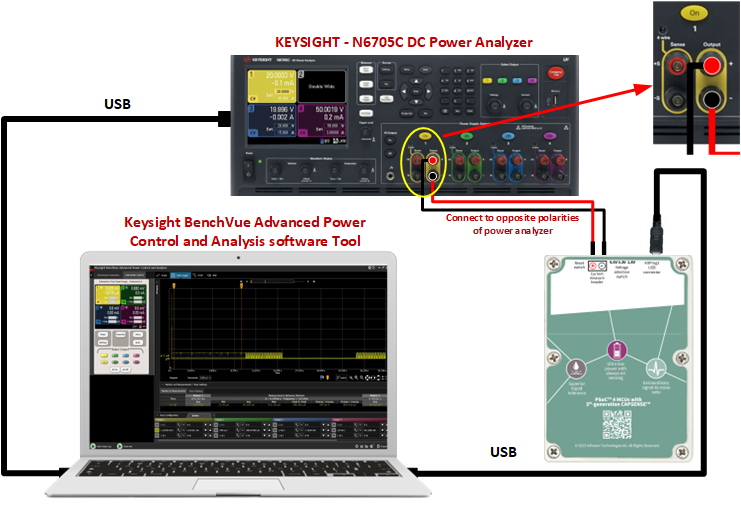

   <br>

5. Control the power analyzer using a software interface called "Keysight BenchVue Advanced Power Control and Analysis".

6. Select the **Current Measure** option from the **Instrument Control** setup. Then, select and turn ON the output channel as shown in the following figure:

   **Figure 13. Current measurement setup**

   

   <br>

7. Capture the data using the data log option from the tool. The average current consumption is measured as shown in the following figure.

   **Figure 14. Current measurement**

   

   <br>

8. Disable MPTX in CAPSENSE&trade; configuration by setting the **Multi-phase Tx order** to **1** as shown in the following figure and re-program the kit. Repeat the steps 2 to 5 to measure the current consumption without MPTX.

   **Figure 15. Disable MPTX**

   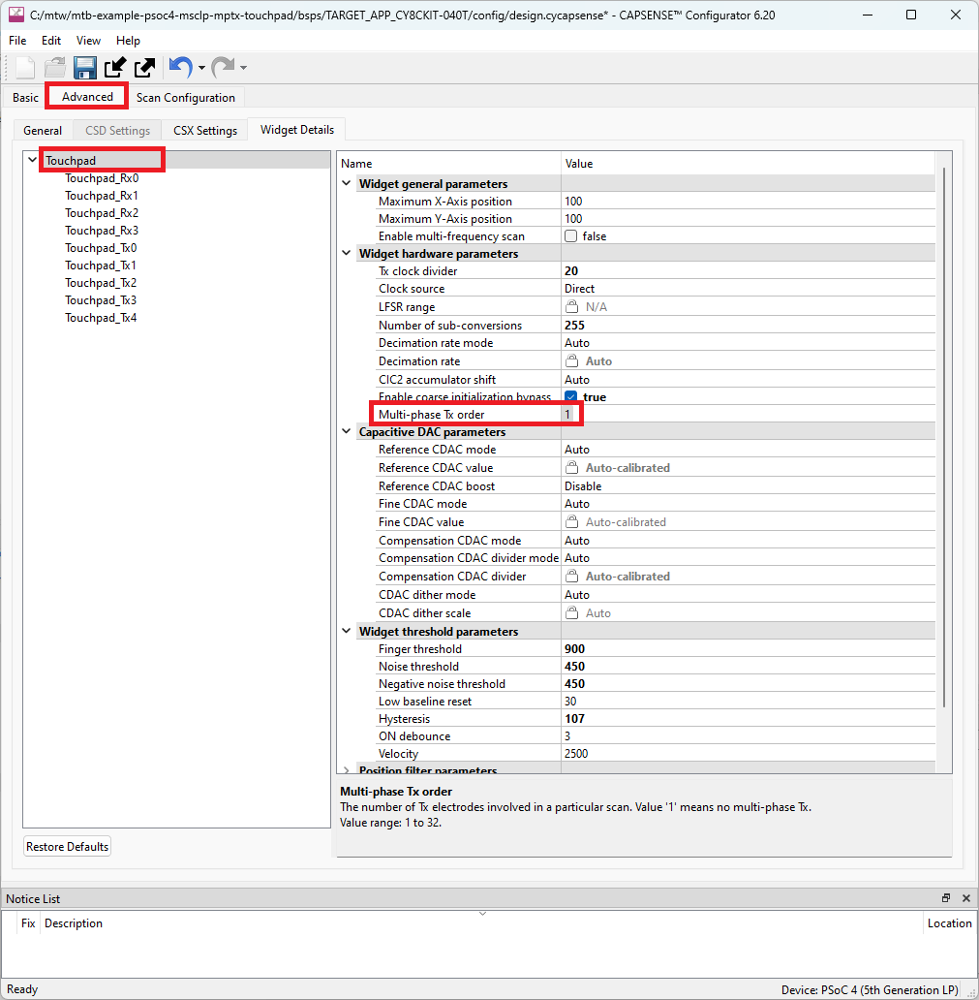

   <br>

The current measured with and without MPTX is shown in the following table.

   **Table 3. Measured current for different modes**

   Widget                    | Current
   :-------------------------|:----------
   **Touchpad** (with MPTX)    |9.80 mA
   **Touchpad0** (without MPTX)|9.17 mA
   
   <br>
   
## Debugging


You can debug the example to step through the code.


<details><summary><b>In Eclipse IDE</b></summary>

Use the **\<Application Name> Debug (KitProg3_MiniProg4)** configuration in the **Quick Panel**. For details, see the "Program and debug" section in the [Eclipse IDE for ModusToolbox&trade; user guide](https://www.infineon.com/MTBEclipseIDEUserGuide).


</details>


<details><summary><b>In other IDEs</b></summary>

Follow the instructions in your preferred IDE.

</details>

By default, the debug option is disabled in the Device Configurator. To enable the debug option, see the [Set up the VDDA supply voltage in Device Configurator](#set-up-the-vdda-supply-voltage-in-device-configurator) section. To achieve low power consumption, it is recommended to disable it. 

   
## Design and implementation

The project contains two touchpad widgets, **Touchpad** widget configured with MPTX technique and **Touchpad0** widget configured with regular CSX-RM technique.

The project uses the [CAPSENSE&trade; middleware](https://github.com/Infineon/capsense) (see [ModusToolbox&trade; CAPSENSE&trade; Configurator user guide](https://www.infineon.com/ModusToolboxCapSenseConfig) for more details on selecting a middleware). See [AN85951 – PSoC&trade; 4 and PSoC&trade; 6 MCU CAPSENSE&trade; design guide](https://www.infineon.com/AN85951) for more details on CAPSENSE&trade; features and usage.

[ModusToolbox&trade;](https://www.infineon.com/modustoolbox) provides a GUI-based tuner application for debugging and tuning the CAPSENSE&trade; system. The CAPSENSE&trade; Tuner application works with EZI2C and UART communication interfaces. This project has an SCB block configured in EZI2C mode to establish communication with the onboard KitProg, which in turn enables reading the CAPSENSE&trade; raw data by the CAPSENSE&trade; Tuner; see **Figure 16**.

The CAPSENSE&trade; data structure that contains the CAPSENSE&trade; raw data is exposed to the CAPSENSE&trade; Tuner by setting up the I2C communication data buffer with the CAPSENSE&trade; data structure. This enables the tuner to access the CAPSENSE&trade; raw data for tuning and debugging CAPSENSE&trade;.

The successful tuning of the touchpad is indicated by the RGB LED in the evaluation kit; the LED1 brightness increases when the finger is moved from bottom-to-top and LED3 brightness increases when the finger is moved from left-to-right on the touchpad.

The MOSI pin of the SPI slave peripheral is used to transfer data to the three serially connected LEDs for controlling color, brightness, and ON or OFF operations. The three LEDs form a daisy-chain connection and the communication happens over the serial interface to create an RGB configuration. The LED accepts a 32-bit input code, with three bytes for red, green, and blue color, five bits for global brightness, and three blank ‘1’ bits. See the [LED datasheet](https://media.digikey.com/pdf/Data%20Sheets/Everlight%20PDFs/12-23C_RSGHBHW-5V01_2C_Rev4_12-17-18.pdf) for more details.

**Implementing MPTX widgets**

The MPTX technique can be used with any CSX widget with more than three Tx electrodes. Because MPTX is not beneficial for CSX widgets with less than four electrodes, MPTX is not supported for those configurations.

The number of Tx electrodes involved in particular scanning defines the MPTX order, e.g., if the number of Tx electrodes is 12, the MPTX order can be set to 4, 6, or 12.
To use MPTX, set the **Multi-phase Tx order** equal to or factor of the number of Tx electrodes in the CSX touchpad widget. Each CSX widget with more than three Tx has a parameter MPTX order set by default to '1', means no multi-phase TX. 

In this application the number of Tx electrodes are 5, therefore, the MPTX order is set to '5'.

**Figure 16. Enabling MPTX in CAPSENSE&trade; Tuner Configurator**

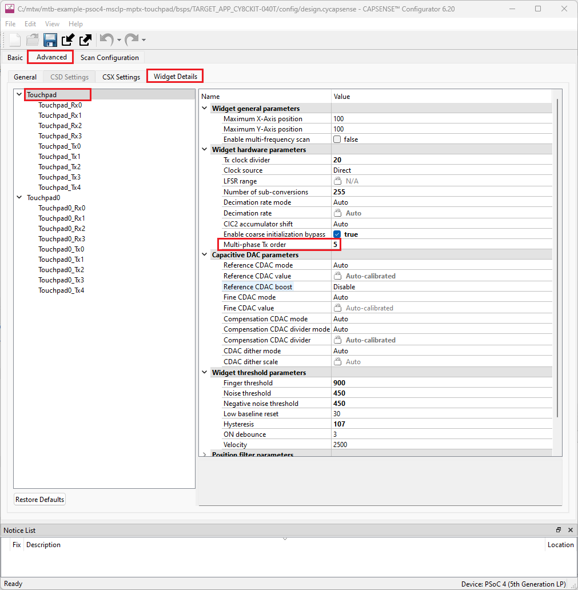

<br>

### Set up the VDDA supply voltage in Device Configurator

1. Open the **Device Configurator** from the **Quick panel**. 

2. Go to the **Systems** tab, select the **Power** resource, and set the VDDA value in **Operating Conditions** as shown in the following figure.

   **Figure 17. Setting the VDDA supply in the System tab of Device Configurator**

   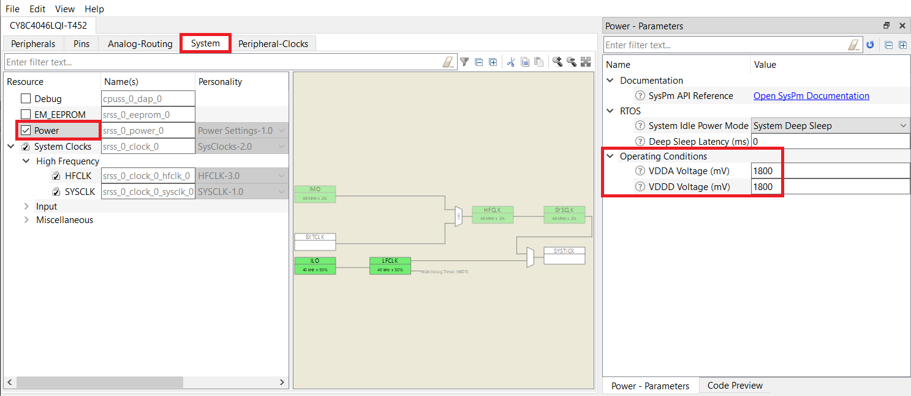

### Resources and settings

See the [Operation](#operation) section for step-by-step instructions to configure the CAPSENSE&trade; configurator.

**Figure 18. Device Configurator - EZI2C peripheral parameters**

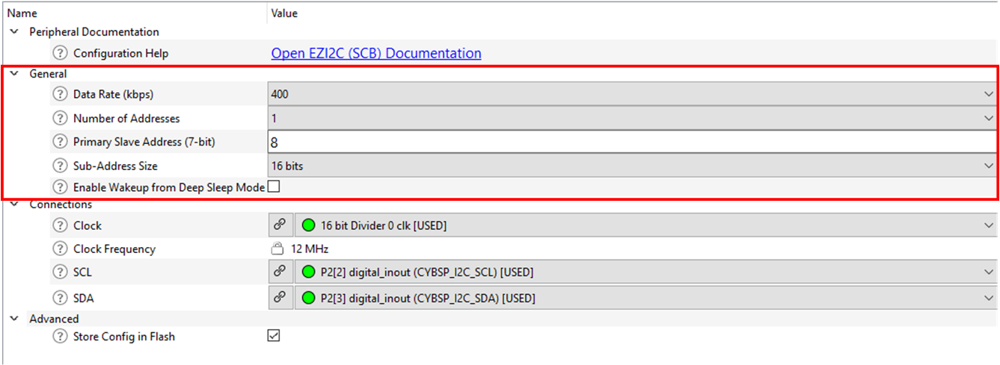

**Figure 19. SPI settings**

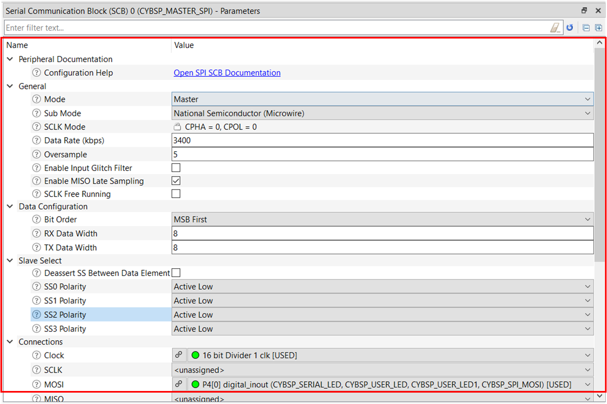

<br>

**Table 4. Application resources**

Resource  |  Alias/object     |    Purpose
:------- | :------------    | :------------
SCB (I2C) (PDL) | CYBSP_EZI2C          | EZI2C slave driver to communicate with CAPSENSE&trade; Tuner GUI
CAPSENSE&trade; | CYBSP_MSCLP0 | CAPSENSE&trade; driver to interact with the MSCLP hardware and interface the CAPSENSE&trade; sensors
Digital pin | CYBSP_USER_LED | To visualize the touchpad response
 
<br>

#### Firmware flow

**Figure 20. Firmware flowchart**

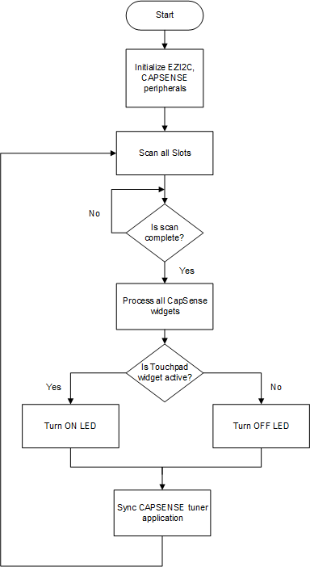

<br>


## Related resources


Resources  | Links
-----------|----------------------------------
Application notes  | [AN79953](https://www.infineon.com/AN79953) – Getting started with PSoC&trade; 4 <br> [AN85951](https://www.infineon.com/AN85951) – PSoC&trade; 4 and PSoC&trade; 6 MCU CAPSENSE&trade; design guide <br> AN234231 - Achieving lowest-power capacitive sensing with PSoC&trade; 4000T
Code examples | [Using ModusToolbox&trade;](https://github.com/Infineon/Code-Examples-for-ModusToolbox-Software) on GitHub <br> [Using PSoC&trade; Creator](https://www.infineon.com/cms/en/design-support/software/code-examples/psoc-3-4-5-code-examples-for-psoc-creator)
Device documentation | [PSoC&trade; 4 datasheets](https://www.infineon.com/cms/en/search.html?intc=searchkwr-return#!view=downloads&term=psoc%204&doc_group=Data%20Sheet) <br>[PSoC&trade; 4 technical reference manuals](https://www.infineon.com/cms/en/search.html#!term=psoc%204%20technical%20reference%20manual&view=all)
Development kits | Select your kits from the [evaluation board finder](https://www.infineon.com/cms/en/design-support/finder-selection-tools/product-finder/evaluation-board)
Libraries on GitHub  | [mtb-hal-cat2](https://github.com/Infineon/mtb-hal-cat2) – Hardware Abstraction Layer (HAL) library
Middleware on GitHub | [capsense](https://github.com/Infineon/capsense) – CAPSENSE&trade; library and documents <br>
Tools  | [ModusToolbox&trade;](https://www.infineon.com/modustoolbox) – ModusToolbox&trade; software is a collection of easy-to-use libraries and tools enabling rapid development with Infineon MCUs for applications ranging from wireless and cloud-connected systems, edge AI/ML, embedded sense and control, to wired USB connectivity using PSoC&trade; Industrial/IoT MCUs, AIROC&trade; Wi-Fi and Bluetooth&reg; connectivity devices, XMC&trade; Industrial MCUs, and EZ-USB&trade;/EZ-PD&trade; wired connectivity controllers. ModusToolbox&trade; incorporates a comprehensive set of BSPs, HAL, libraries, configuration tools, and provides support for industry-standard IDEs to fast-track your embedded application development.

<br>


## Other resources


Infineon provides a wealth of data at [www.infineon.com](https://www.infineon.com) to help you select the right device, and quickly and effectively integrate it into your design.


## Document history

Document title: *CE239037* - *PSoC&trade; 4: MSCLP multi-phase mutual-capacitance touchpad*

 Version | Description of change
 ------- | ---------------------
 1.0.0   | New code example to showcase MPTX technique. <br> This version is not backward compatible with ModusToolbox&trade; v2.4
<br>


All referenced product or service names and trademarks are the property of their respective owners.

The Bluetooth&reg; word mark and logos are registered trademarks owned by Bluetooth SIG, Inc., and any use of such marks by Infineon is under license.

---------------------------------------------------------

© Cypress Semiconductor Corporation, 2024. This document is the property of Cypress Semiconductor Corporation, an Infineon Technologies company, and its affiliates ("Cypress").  This document, including any software or firmware included or referenced in this document ("Software"), is owned by Cypress under the intellectual property laws and treaties of the United States and other countries worldwide.  Cypress reserves all rights under such laws and treaties and does not, except as specifically stated in this paragraph, grant any license under its patents, copyrights, trademarks, or other intellectual property rights.  If the Software is not accompanied by a license agreement and you do not otherwise have a written agreement with Cypress governing the use of the Software, then Cypress hereby grants you a personal, non-exclusive, nontransferable license (without the right to sublicense) (1) under its copyright rights in the Software (a) for Software provided in source code form, to modify and reproduce the Software solely for use with Cypress hardware products, only internally within your organization, and (b) to distribute the Software in binary code form externally to end users (either directly or indirectly through resellers and distributors), solely for use on Cypress hardware product units, and (2) under those claims of Cypress's patents that are infringed by the Software (as provided by Cypress, unmodified) to make, use, distribute, and import the Software solely for use with Cypress hardware products.  Any other use, reproduction, modification, translation, or compilation of the Software is prohibited.
<br>
TO THE EXTENT PERMITTED BY APPLICABLE LAW, CYPRESS MAKES NO WARRANTY OF ANY KIND, EXPRESS OR IMPLIED, WITH REGARD TO THIS DOCUMENT OR ANY SOFTWARE OR ACCOMPANYING HARDWARE, INCLUDING, BUT NOT LIMITED TO, THE IMPLIED WARRANTIES OF MERCHANTABILITY AND FITNESS FOR A PARTICULAR PURPOSE.  No computing device can be absolutely secure.  Therefore, despite security measures implemented in Cypress hardware or software products, Cypress shall have no liability arising out of any security breach, such as unauthorized access to or use of a Cypress product. CYPRESS DOES NOT REPRESENT, WARRANT, OR GUARANTEE THAT CYPRESS PRODUCTS, OR SYSTEMS CREATED USING CYPRESS PRODUCTS, WILL BE FREE FROM CORRUPTION, ATTACK, VIRUSES, INTERFERENCE, HACKING, DATA LOSS OR THEFT, OR OTHER SECURITY INTRUSION (collectively, "Security Breach").  Cypress disclaims any liability relating to any Security Breach, and you shall and hereby do release Cypress from any claim, damage, or other liability arising from any Security Breach.  In addition, the products described in these materials may contain design defects or errors known as errata which may cause the product to deviate from published specifications. To the extent permitted by applicable law, Cypress reserves the right to make changes to this document without further notice. Cypress does not assume any liability arising out of the application or use of any product or circuit described in this document. Any information provided in this document, including any sample design information or programming code, is provided only for reference purposes.  It is the responsibility of the user of this document to properly design, program, and test the functionality and safety of any application made of this information and any resulting product.  "High-Risk Device" means any device or system whose failure could cause personal injury, death, or property damage.  Examples of High-Risk Devices are weapons, nuclear installations, surgical implants, and other medical devices.  "Critical Component" means any component of a High-Risk Device whose failure to perform can be reasonably expected to cause, directly or indirectly, the failure of the High-Risk Device, or to affect its safety or effectiveness.  Cypress is not liable, in whole or in part, and you shall and hereby do release Cypress from any claim, damage, or other liability arising from any use of a Cypress product as a Critical Component in a High-Risk Device. You shall indemnify and hold Cypress, including its affiliates, and its directors, officers, employees, agents, distributors, and assigns harmless from and against all claims, costs, damages, and expenses, arising out of any claim, including claims for product liability, personal injury or death, or property damage arising from any use of a Cypress product as a Critical Component in a High-Risk Device. Cypress products are not intended or authorized for use as a Critical Component in any High-Risk Device except to the limited extent that (i) Cypress's published data sheet for the product explicitly states Cypress has qualified the product for use in a specific High-Risk Device, or (ii) Cypress has given you advance written authorization to use the product as a Critical Component in the specific High-Risk Device and you have signed a separate indemnification agreement.
<br>
Cypress, the Cypress logo, and combinations thereof, ModusToolbox, PSoC, CAPSENSE, EZ-USB, F-RAM, and TRAVEO are trademarks or registered trademarks of Cypress or a subsidiary of Cypress in the United States or in other countries. For a more complete list of Cypress trademarks, visit www.infineon.com. Other names and brands may be claimed as property of their respective owners.
